# 手势识别

[](https://creativecommons.org/licenses/by-nc-nd/4.0/)

一个基于计算机视觉与深度学习的实时手势识别系统。该项目通过使用 MediaPipe 和 PyTorch，通过你的摄像头检测和分类各种手势。

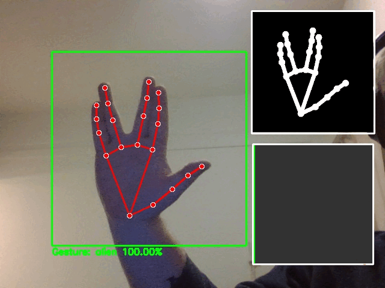

## 简介

手势识别系统提供了一个直观的界面，用于实时检测和分类手势。它使用 MediaPipe 进行手部关键点检测，并使用自定义训练的 PyTorch CNN 模型进行手势分类。

## 功能

- **实时处理**：从摄像头输入中即时检测和分类手势
- **集成 MediaPipe**：精确的手部关键点检测和追踪
- **自定义 CNN 模型**：训练的神经网络用于准确手势分类
- **可视化工具**：实时置信度评分和概率分布
- **可扩展设计**：通过自定义训练轻松添加新手势
- **数据增强**：通过镜像图像扩展训练数据集的工具
- **交互式界面**：简单的键盘控制用于采集和训练模式

## 支持的手势

系统可识别以下手势（通过训练可添加更多）：

| 手势       | 描述                   | 示例图像                                                     |
| ---------- | ---------------------- | ------------------------------------------------------------ |
| One        | 食指伸出               | 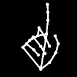 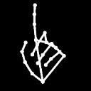 |
| Peace      | 食指和中指做 V 字      | 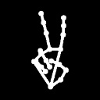 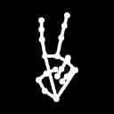 |
| Three      | 三根手指伸出           | 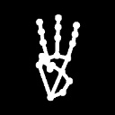  |
| Three_alt  | 三指替代手势           |  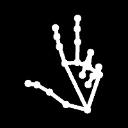 |
| Four       | 四根手指伸出           | 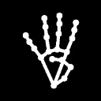 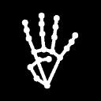 |
| Four_alt   | 四指替代手势           | 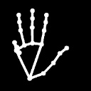 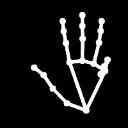 |
| Stop       | 手掌朝前五指张开       | 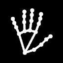 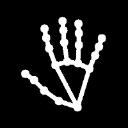 |
| L          | 拇指和食指构成 L 形    | 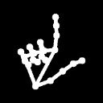     |
| Love       | “我爱你” 手势          | 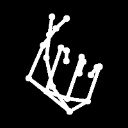  |
| Thumb_up   | 竖起大拇指             | 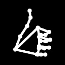 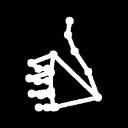 |
| Thumb_down | 大拇指向下             |   |
| Thumb_out  | 大拇指向侧边伸出       |  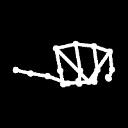 |
| Fist       | 握拳                   |   |
| Zero       | 拇指与其他手指构成圆圈 | 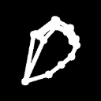  |
| Ok         | OK 手势                |  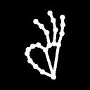  |
| Cross      | 手指交叉               |  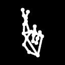 |
| Bird       | 中指竖起               | 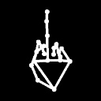 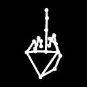 |
| Bird_alt   | 中指替代手势           | 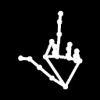 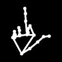 |
| Rock       | 摇滚手势（魔鬼角）     | 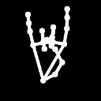 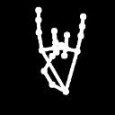 |
| Rock_alt   | 摇滚手势替代形式       |   |
| Call       | 打电话手势             | 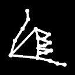 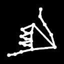 |
| Point      | 食指指向前方           |   |
| Alien      | 外星人手势             | 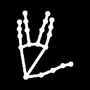 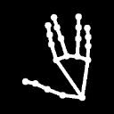 |
| Little     | 拇指和食指伸出但不接触 | 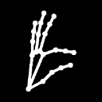 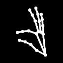 |

## 混淆矩阵

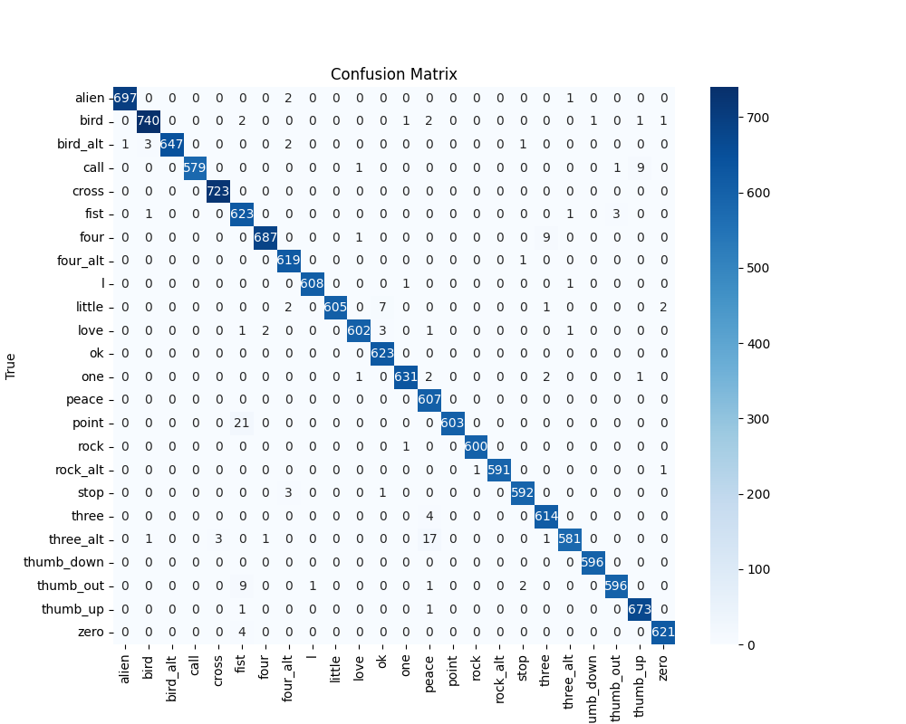

## 依赖要求

- Python 3.11 - 3.12（与 3.10 和可能的 3.13 不兼容）
- 摄像头
- 支持 CUDA 的 GPU（可选）
- `requirements.txt` 中列出的依赖

## 安装

1. 克隆仓库：
   ```bash
   git clone https://github.com/SirAlexiner/HandGestureRecognition.git
   cd HandGestureRecognition
   ```

2. 创建并激活虚拟环境（推荐）：
   ```bash
   python -m venv venv
   # Windows
   venv\Scripts\activate
   # macOS/Linux
   source venv/bin/activate
   ```

3. 安装依赖：
   ```bash
   pip install -r requirements.txt
   ```

4. 下载预训练模型（或自行训练）：
   ```bash
   # 从本仓库下载
   # 或参照下文训练说明
   ```

## 使用

### 启动识别系统

```bash
python main.py
```

### 控制

- **按 'c'**：采集新手势的训练数据
- **按 'q'**：退出程序

### 可视化

- 手部关键点与骨架
- 包围手部的边框
- 手势分类与置信度
- 所有手势类别的概率图
- 角落中的 ROI 预览

### 界面


界面包含：
1. 主摄像头视图
2. 提取的手部 ROI 区域
3. 识别结果与置信度
4. 概率分布图

## 自定义模型训练

### 数据采集

1. 运行主程序：
   ```bash
   python main.py
   ```
2. 按 `c` 进入采集模式
3. 输入手势名称
4. 在摄像头前做手势
5. 再按 `c` 停止采集

图像保存在 `data/custom/[gesture_name]`

### 数据增强

```bash
python mirror.py
```

生成图像镜像，增加数据量并提高稳定性。

### 训练与测试

```bash
python train.py
```

- 数据划分：训练 70%，验证 20%，测试 10%
- 模型结构：5 卷积层 + 3 全连接层，含 Dropout
- 自动保存最佳模型并评估

训练包含：
- 数据增强（旋转、平移）
- 提前停止
- 学习率调度

### 提前终止后的测试

```bash
python test.py
```

- 测试模型并保存
- 生成混淆矩阵

## 项目结构

```
HandGestureRecognition/
├── main.py                          # 主程序
├── train.py                         # 训练脚本
├── test.py                          # 测试脚本
├── mirror.py                        # 数据增强工具
├── requirements.txt                 # 依赖列表
├── best_hand_gesture_classifier.pt  # 最佳模型
├── data/                            # 数据目录
│   └── custom/                      # 自定义手势
├── images/                          # 图片目录
│   ├── demo.gif                     # 演示动画
│   ├── interface_example.jpg        # 界面截图
│   └── gestures/                    # 手势图像
├── LICENSE.md
├── CODE_OF_CONDUCT.md
├── CONTRIBUTING.md
└── README.md
```

## 工作原理

### 技术细节

1. **手部检测**：MediaPipe 获取 21 个关键点
2. **ROI 提取**：动态捕获手部区域
3. **预处理**：黑底白线手势图，128x128，归一化
4. **分类器**：CNN 输出概率，取最大概率作为预测
5. **可视化**：颜色表示置信度，柱状图显示分布

### 模型结构

- 输入：1x128x128 灰度图
- 5 卷积层（含归一化与池化）
- 3 全连接层（含 Dropout）
- 输出：N 类手势

详情参考：[MATH.md](MATH.md)

## 路线图

- [ ] 支持双手手势
- [ ] 手势序列识别
- [ ] GUI 训练界面
- [ ] 更多预训练手势
- [ ] 动态手势识别
- [ ] 应用 API 集成

## 贡献

欢迎贡献！步骤如下：

1. Fork 项目
2. 克隆到本地
3. 创建新分支
4. 修改并提交
5. Push 到你的仓库
6. 发起 Pull Request

请遵守 [CODE_OF_CONDUCT.md](CODE_OF_CONDUCT.md) 与 [CONTRIBUTING.md](CONTRIBUTING.md)。

## 支持

如需支持，请在 GitHub 提 issue。

## 许可证

本项目基于：  
[](https://creativecommons.org/licenses/by-nc-nd/4.0/)

仅供教育、个人学习和非商业使用。禁止商用或变相盈利。

## 鸣谢

- [MediaPipe](https://mediapipe.dev/)
- [PyTorch](https://pytorch.org/)
- [OpenCV](https://opencv.org/)
- 所有贡献者
