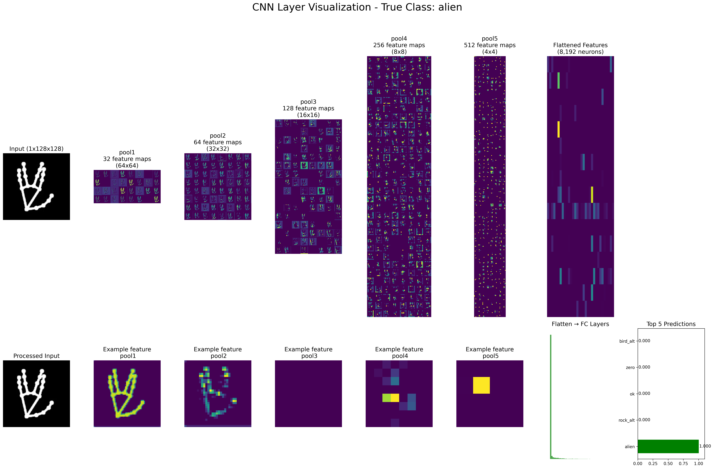
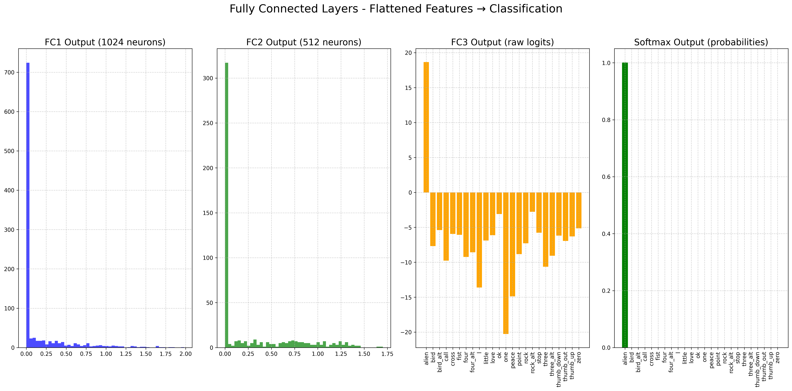

# Hand Gesture Recognition

[](https://creativecommons.org/licenses/by-nc-nd/4.0/)

A real-time hand gesture recognition system using computer vision and deep learning. This project detects and classifies various hand gestures through your webcam with MediaPipe and PyTorch.


## Introduction

The Hand Gesture Recognition system provides an intuitive interface for detecting and classifying hand gestures in real-time. It uses MediaPipe for hand landmark detection and a custom-trained PyTorch CNN model for gesture classification.

## Authors
This code was developed by:
- [@SirAlexiner](https://github.com/SirAlexiner)

## Features

- **Real-time Processing**: Detect and classify hand gestures instantly from webcam input
- **MediaPipe Integration**: Precise hand landmark detection and tracking
- **Custom CNN Model**: Trained neural network for accurate gesture classification
- **Visualization Tools**: Real-time confidence scores and probability distribution
- **Extensible Design**: Easy addition of new gestures through custom training
- **Data Augmentation**: Tool for expanding training dataset with mirrored images
- **Interactive Interface**: Simple keyboard controls for capture and training modes

## Supported Gestures

The system can recognize the following gestures (and more can be added through training):

| Gesture    | Description                          | Example Images                                                                                                                      |
|------------|--------------------------------------|-------------------------------------------------------------------------------------------------------------------------------------|
| One        | Index finger extended                |                               |
| Peace      | V sign with index and middle fingers |                       |
| Three      | Three fingers extended               |                       |
| Three_alt  | Alternative three fingers pose       |       |
| Four       | Four fingers extended                |                           |
| Four_alt   | Alternative four fingers pose        |           |
| Stop       | Hand up, all fingers extended        |                           |
| L          | L shape with thumb and index         |                                       |
| Love       | "I love you" sign                    |                           |
| Thumb_up   | Thumbs up gesture                    |           |
| Thumb_down | Thumbs down gesture                  |   |
| Thumb_out  | Thumb extended to side               |       |
| Fist       | Closed fist                          |                           |
| Zero       | Circle formed with thumb and fingers |                           |
| Ok         | OK sign                              |                                   |
| Cross      | Crossed fingers                      |                       |
| Bird       | Middle finger extended               |                           |
| Bird_alt   | Alternative bird gesture             |           |
| Rock       | Rock/devil horns sign                |                           |
| Rock_alt   | Alternative devil horns              |           |
| Call       | Phone call gesture                   |                           |
| Point      | Pointing with index finger           |                       |
| Alien      | Alien hand sign                      |                       |
| Little     | Index & thumb extended not touching  |                   |

## Confusion Matrix


## Requirements

- Python 3.11(?) - 3.12 (not compatible with Python 3.10, possibly 3.13)
- Webcam
- CUDA-capable GPU (optional, for faster training)
- Required packages listed in `requirements.txt`

## Installation

1. Clone the repository:
   ```bash
   git clone https://github.com/SirAlexiner/HandGestureRecognition.git
   cd HandGestureRecognition
   ```

2. Create and activate a virtual environment (recommended):
   ```bash
   python -m venv venv
   # On Windows
   venv\Scripts\activate
   # On macOS/Linux
   source venv/bin/activate
   ```

3. Install the required packages:
   ```bash
   pip install -r requirements.txt
   ```

4. Download the pre-trained model (or train your own):
   ```bash
   # Download from this repo
   # Or follow the training instructions below
   ```

## Usage

### Running the Recognition System

To start the hand gesture recognition system:

```bash
python main.py
```

### Controls

- **Press 'c'**: Toggle capture mode for collecting training data for new gestures
- **Press 'q'**: Quit the application

### Visualization

The application provides real-time visualization with:
- Hand landmark detection with wireframe overlay
- Bounding box around detected hand
- Gesture classification result with confidence score
- Probability distribution chart for all gestures
- Small hand ROI preview in the corner

### Interface


The interface displays:
1. Main camera view with hand detection
2. ROI (Region of Interest) extracted around your hand
3. Recognition result with confidence level
4. Probability chart for all gesture classes

## Training Your Own Model

### Data Collection

1. Run the main application:
   ```bash
   python main.py
   ```

2. Press 'c' to enter capture mode
3. Enter the name of the gesture you want to capture
4. Make the gesture in front of your webcam
5. Press 'c' again to stop capturing
6. Repeat for different gestures

The captured images will be saved in the `data/custom/[gesture_name]` directory.

### Data Augmentation

To mirror your training images (increases dataset variety):

```bash
python mirror.py
```

This will create mirrored versions of all training images, effectively doubling your dataset size and improving model robustness.

(Skips previously mirror images, preventing duplicates)

### Training, Testing & Finalizing Process

Train & Test the gesture recognition model on your collected data:

```bash
python train.py
```

This will:
1. Load images from the data/custom directory
2. Split data into training (70%), validation (20%), and test (10%) sets
3. Train a convolutional neural network with the following architecture:
   - 5 convolutional layers with batch normalization
   - Dropout regularization
   - 3 fully connected layers
4. Save the best model as `best_hand_gesture_model.pth` 
   <br> (This file can be terminated after this happens)
5. Evaluate the model on the test set
6. Save the optimized model as `best_hand_gesture_classifier.pt`
7. Generate a confusion matrix to visualize model performance

The training includes:
- Data augmentation (rotation, translation)
- Early stopping to prevent overfitting
- Learning rate scheduling
- Validation accuracy monitoring

### Testing and Finalizing the Model (Terminated Training)

If you terminate training early, you NEED to run the test script to prepare the model for inference:

```bash
python test.py
```

This will:
1. Evaluate the model on the test set
2. Save the optimized model as `best_hand_gesture_classifier.pt`
3. Generate a confusion matrix to visualize model performance

<br>(Steps 5-6 of `train.py`)

## Project Structure

```
HandGestureRecognition/
├── main.py                          # Main application
├── train.py                         # Model training script
├── test.py                          # Model testing script
├── mirror.py                        # Data augmentation utility
├── requirements.txt                 # Required packages
├── best_hand_gesture_classifier.pt  # Pre-trained model
├── data/                            # Training data directory
│   └── custom/                      # Custom gesture data
│       ├── love/                    # Images for "love" gesture
│       ├── peace/                   # Images for "peace" gesture
│       └── ...                      # Other gesture folders
├── images/                          # README images
│   ├── demo.gif                     # Demo animation
│   ├── interface_example.jpg        # Interface screenshot
│   ├── confusion_matrix.png         # Confusion Matrix screenshot
│   └── gestures/                    # Example gesture images
│       ├── peace.jpg                # Peace sign example
│       ├── love.jpg                 # Love sign example
│       └── ...                      # Other gesture examples
├── LICENSE.md                       # License information
├── CODE_OF_CONDUCT.md               # Code of conduct
├── CONTRIBUTING.md                  # Contribution guidelines
└── README.md                        # This file
```

## How It Works

### Technical Implementation

1. **Hand Detection**: 
   - MediaPipe Hands detects and tracks 21 hand landmarks
   - Landmarks are normalized to hand size and position

2. **Region of Interest**: 
   - A square region containing the hand is extracted with padding
   - The region is dynamically adjusted to follow hand movements

3. **Preprocessing**: 
   - The hand landmarks are drawn as a white wireframe on black background
   - This wireframe representation enhances gesture recognition robustness
   - The image is resized to 128x128 and normalized

4. **Classification**: 
   - The CNN model predicts the gesture class from the preprocessed image
   - The model outputs probabilities for each possible gesture
   - The highest probability gesture is selected as the prediction

5. **Visualization**: 
   - Results are displayed with color-coded confidence scores
   - A probability chart shows relative confidence for all classes

### Model Architecture




The CNN model consists of:
- Input: 1x128x128 grayscale image
- 5 convolutional blocks with batch normalization and max pooling
- 3 fully connected layers with dropout regularization
- Output: N classes (where N is the number of gestures)

Full mathematical explanations and equations can be found here: [MATH.md](MATH.md)

## Roadmap

- [ ] Add support for two-handed gestures
- [ ] Implement gesture sequence recognition for commands
- [ ] Create a GUI for easier model training
- [ ] Add more pre-trained gestures
- [ ] Support for dynamic gestures (movements)
- [ ] Integration with applications via API

## Contributing

Contributions to the Hand Gesture Recognition project are welcome! To contribute, follow these steps:

1. Fork the repository on GitHub
2. Clone your forked repository to your local machine
3. Create a new branch for your changes
4. Make your changes and commit them with clear and concise messages
5. Push your changes to your forked repository
6. Submit a pull request to the original repository

Please adhere to the project's code of conduct and contribution guidelines provided in the [CODE_OF_CONDUCT.md](CODE_OF_CONDUCT.md) and [CONTRIBUTING.md](CONTRIBUTING.md) files, respectively.

## Support

For support, email `sir_alexiner@hotmail.com` or open an issue on GitHub.

## License

This project is licensed under:
[](https://creativecommons.org/licenses/by-nc-nd/4.0/)

You are free to download and use this code for educational, personal learning, or non-commercial purposes.
While we encourage these uses, please note that using this project for commercial distribution,
sales, or any form of monetization is not permitted.

## Acknowledgments

- [MediaPipe](https://mediapipe.dev/) for hand detection
- [PyTorch](https://pytorch.org/) for deep learning framework
- [OpenCV](https://opencv.org/) for computer vision components
- All contributors who have helped improve this project